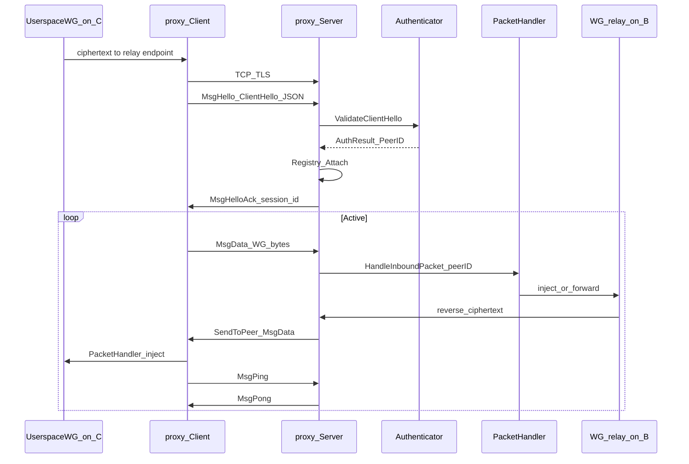

# Netmaker Phase 1 Proxy — Implemented Plan & Current Architecture

**Module:** `github.com/gravitl/proxy` (flat package at repo root; import `github.com/gravitl/proxy`)  
**Commit:** `feat(proxy): add TCP/TLS framed transport for relay uplinks`  
**Status:** Phase 1 **transport library is implemented and tested**. Netclient/relay integration is **not** currently in the netclient tree.

---

## 1. Product goal (Phase 1)

**Problem:** Peer **C** must use relay/gateway **B**, but UDP to B may be blocked.

**Solution:** Replace only the **C ↔ B uplink** with:

```text
TCP + TLS + framed WireGuard ciphertext
```

**Topology:**

```text
Before:  C -- WG/UDP --> B -- relay --> A/D
Phase 1: C -- TCP/TLS (WG packets) --> B -- relay --> A/D
```

**Important:** **B is still a WireGuard peer** (keys, interface, relay logic). Only the transport from C to B changes. After packets enter B’s WG/relay path, behavior is unchanged.

---

## 2. Design principles (as built)

| Principle | How it shows up |
|-----------|-----------------|
| Package-first | Standalone Go module, importable |
| Transport ≠ policy | No Netmaker DB, routing, or relay selection inside `proxy` |
| Small API | `Client` + `Server` + hooks |
| Plug-and-play | Auth, packet handling, registry, logger, metrics are interfaces/callbacks |
| Extensible later | TLS config, hooks; no HTTP CONNECT / mTLS / multitenancy yet |

**Out of scope (still):** UDP→TCP fallback, HTTP CONNECT, WebSocket, mTLS requirement, active-active relay, node-global proxy mode.

---

## 3. What was implemented (checklist)

### Done in `gravitl/proxy`

| Item | Status | Location |
|------|--------|----------|
| Module + `go.mod` | Done | `go.mod` (Go 1.22) |
| Framing codec | Done | `frame.go` |
| Protocol constants | Done | `protocol.go` |
| Types / states / hello | Done | `types.go` |
| Hooks | Done | `interfaces.go` |
| Errors | Done | `errors.go` |
| In-memory registry | Done | `registry.go` |
| No-op logger/metrics | Done | `noop.go` |
| Client (TLS, HELLO, DATA, ping, reconnect) | Done | `client.go` |
| Server (TLS, auth, registry, SendToPeer) | Done | `server.go` |
| Frame unit tests | Done | `frame_test.go` |
| TLS integration round-trip | Done | `integration_test.go` |
| Package doc + README + example | Done | `doc.go`, `README.md`, `example_test.go` |

### Planned but not landed (outside this repo)

| Item | Status |
|------|--------|
| Control-plane gateway TCP + node uplink flags | **Done** (Phase 1A in netmaker) |
| Gateway netclient `proxy.Server` + WG inject | Not done |
| Relayed netclient `proxy.Client` + userspace `conn.Bind` | Not done |
| TLS certs for gateway TCP listen | Not done |

---

## 4. Current package layout

```text
github.com/gravitl/proxy/
├── go.mod
├── README.md
├── doc.go              # package role / non-goals
├── protocol.go         # version, Msg* types, DefaultMaxFrameSize
├── types.go            # ClientHello, AuthResult, states, BackoffConfig
├── interfaces.go       # PacketHandler, Authenticator, SessionRegistry, Session, Logger, Metrics
├── errors.go
├── frame.go            # 12-byte header encode/decode
├── registry.go         # InMemoryRegistry (replace-on-attach)
├── noop.go
├── client.go           # Client API + supervisor/reconnect
├── server.go           # Server API + accept/session loops
├── frame_test.go
├── integration_test.go
└── example_test.go
```

Note: Original plan used `pkg/proxy`; **as shipped**, types live at module root (`import "github.com/gravitl/proxy"`).

---

## 5. Current architecture

### 5.1 Role of the package

```text
┌─────────────────────────────────────────────────────────┐
│  Adapter / Netmaker (NOT in this package)               │
│  - token / Authenticator                                │
│  - relay selection, RelayedBy                           │
│  - wire userspace WG Bind ↔ SendPacket / inject         │
│  - call SendToPeer from existing relay reverse path     │
└───────────────┬───────────────────────────┬─────────────┘
                │                           │
        proxy.Client                 proxy.Server
                │                           │
                └──────── TCP/TLS ──────────┘
                     framed MsgData
              (encrypted WG packet bytes)
```

**Owns:** dial/listen, TLS, framing, session lifecycle, keepalive, peer→session map, packet loops.  
**Does not own:** routing, peer policy, DB, control plane, full relay engine.

### 5.2 End-to-end data path (intended)



**Critical constraint:** Kernel WireGuard cannot plug into this API. Integration requires **userspace WireGuard** (`conn.Bind`) or another inject path — on **client and relay** sides that terminate TCP.

### 5.3 Framing protocol (implemented)

**Header (12 bytes, big-endian):**

| Offset | Field | Size |
|--------|--------|------|
| 0 | `version` | 1 (`ProtocolVersion = 1`) |
| 1 | `msgType` | 1 |
| 2 | `flags` | 2 |
| 4 | `sessionID` | 4 |
| 8 | `payloadLen` | 4 |

Then `payload` of length `payloadLen`, capped by `MaxFrameSize` (default **65536**).

**Message types:**

| Const | Value | Payload |
|-------|-------|---------|
| `MsgHello` | 1 | JSON `ClientHello` |
| `MsgHelloAck` | 2 | JSON `{"session_id":N}` |
| `MsgData` | 3 | Raw WG ciphertext |
| `MsgPing` | 4 | empty |
| `MsgPong` | 5 | empty |
| `MsgClose` | 6 | optional |
| `MsgError` | 7 | JSON `{code,message}` |

### 5.4 Handshake & auth

```text
TCP connect → TLS handshake → MsgHello → Authenticator.ValidateClientHello
  → success: MsgHelloAck(session_id) + Attach(peerID)
  → failure: MsgError(auth_failed) + close
→ DATA / PING / PONG loop
```

`ClientHello` fields: `version`, `node_id`, `relay_peer_id`, `network_id`, `token`, `timestamp`.  
Validation is **delegated** to `Authenticator` — package only enforces message order.

### 5.5 Client architecture

**API:**

```text
NewClient(ClientOptions) (*Client, error)
Start(ctx) / Stop(ctx)
SendPacket(ctx, pkt)  // MsgData when StateActive
State() ClientState
```

**Options:** `Addr`, `ServerName`, `TLSConfig` (required), `HelloFactory`, `PacketHandler`, `Logger`, `Metrics`, `KeepAlivePeriod` (default 30s), `ReconnectBackoff`, `MaxFrameSize`.

**Behavior:**

- Supervisor loop: dial → TLS → HELLO → wait ACK → `StateActive`
- Read loop: `MsgData` → `PacketHandler`; ping/pong; close/error → reconnect
- Client keepalive: ticker sends `MsgPing`
- Reconnect with exponential backoff (`Initial` 1s, `Max` 30s, `Factor` 1.5 by default)
- States: `disconnected` → `connecting` → `tls_ready` → `authenticating` → `active` / `failed` / `closing`

### 5.6 Server architecture

**API:**

```text
NewServer(ServerOptions) (*Server, error)
Start(ctx) / Stop(ctx)
SendToPeer(ctx, peerID, pkt)  // reverse MsgData
Addr() net.Addr                 // bound listen address (e.g. :0)
```

**Options:** `ListenAddr`, `TLSConfig`, `Authenticator`, `PacketHandler` (required); `SessionRegistry` (default in-memory); logger/metrics/keepalive/max frame.

**Per connection:**

1. First frame must be `MsgHello`
2. Authenticate → assign monotonic `sessionID`
3. `MsgHelloAck` → `SessionAttached` → `registry.Attach`
4. Read loop: `MsgData` → `HandleInboundPacket`; `MsgPing` → `MsgPong`; close → `Detach`
5. `SendToPeer` looks up session and writes `MsgData`

**Registry:** replace-on-attach; old session `Close()` if it implements `Close() error`.

### 5.7 Plug-and-play contracts

| Hook | Who implements | When called |
|------|----------------|-------------|
| `HelloFactory` | Client adapter | Each connect attempt |
| `PacketHandler` (client `func([]byte)`) | Client adapter | Inbound DATA from relay |
| `Authenticator` | Server adapter | After HELLO |
| `PacketHandler` (server interface) | Server adapter | Inbound DATA from attached peer |
| `SessionRegistry` | Optional custom | Attach/Get/Detach |
| `Logger` / `MetricsSink` | Optional | Observability |

---

## 6. Integration model (intended vs current)

### Intended client (netclient)

```text
Userspace WG (conn.Bind)
  Send → if dest == relay UDP endpoint → proxy.Client.SendPacket
  Recv ← proxy PacketHandler injects bytes as if from relay
Daemon starts proxy.Client when UseTcpUplink is set (from peer update / HostPull)
TLS + HelloFactory(token from auth.Authenticate)
Dial gateway TcpProxyEndpoint from PeerIDs / HostNetworkInfo
```

### Intended server (relay B)

```text
proxy.Server on B (same host as WG peer) when TcpProxyEnabled
Authenticator validates token → PeerID
PacketHandler → existing relay / WG inject path
Relay reverse path → server.SendToPeer(peerID, pkt)
```

### Current reality

- **Library (`gravitl/proxy`):** ready to import and use.
- **Control plane (Phase 1A, netmaker):** done — see §9. Flags and TCP endpoints are published in peer updates / HostPull. Clients **ignore** them until runtime work lands; UDP relay remains the live path.
- **Netclient runtime:** not wired (`proxy.Client` / userspace Bind).
- **Gateway runtime:** not wired (`proxy.Server`).
- **Kernel WG:** cannot use this without userspace (or a custom inject path).

---

## 7. Defaults & errors (as coded)

| Setting | Default |
|---------|---------|
| Protocol version | `1` |
| Max frame payload | `65536` |
| Keepalive | `30s` |
| Client backoff | 1s → ×1.5 → max 30s |

| Error | Meaning |
|-------|---------|
| `ErrNoSession` | `SendToPeer` unknown peer |
| `ErrSessionClosed` | write on closed session |
| `ErrInvalidFrame` | bad/oversized frame |
| `ErrProtocolVersion` | wrong version |
| `ErrClientClosed` / `ErrServerClosed` | not connected / stopped |

---

## 8. What’s next (if continuing)

1. Gateway netclient: start `proxy.Server` when own node has `TcpProxyEnabled` (Phase 1B)
2. Relayed netclient: when `UseTcpUplink`, dial `TcpProxyEndpoint` via `proxy.Client` + userspace `conn.Bind`
3. TLS cert provisioning for the gateway TCP listener
4. E2E test: C (TCP) → B → A with UDP blocked to B

---

## 9. Control plane (Phase 1A) — Netmaker

On-demand TCP proxy is **triggered from the server**. Two independent switches:

| Role | Field | Meaning |
|------|--------|---------|
| Gateway node | `tcp_proxy_enabled` + `tcp_proxy_listen_port` | Gateway may accept TCP/TLS uplinks (default port **443** if enabled with port 0) |
| Assigned node | `use_tcp_uplink` | Opt into TCP uplink to its gateway (requires gateway TCP enabled) |

### APIs

| Method | Path | Behavior |
|--------|------|----------|
| POST | `/api/nodes/{net}/{id}/gateway` | `CreateGwReq.tcp_proxy_enabled` / `tcp_proxy_listen_port` |
| PUT | `/api/nodes/{net}/{id}/gateway/tcp_proxy` | Body `{ "enabled": bool, "listen_port": int }` |
| POST | `/api/nodes/{net}/{id}/gateway/assign?gw_id=&use_tcp_uplink=true` | Rejects if GW lacks TCP proxy |
| POST | `/api/nodes/{net}/{id}/gateway/unassign` | Clears `use_tcp_uplink` |
| DELETE | `/api/nodes/{net}/{id}/gateway` | Clears TCP proxy fields on gateway; unassigns clients clear uplink |

### Peer update / HostPull publish

- `HostPeerUpdate.Nodes[]`: carries `tcp_proxy_enabled`, `tcp_proxy_listen_port`, `use_tcp_uplink` on each node.
- `HostNetworkInfo` (by host pubkey): `tcp_proxy_enabled`, `tcp_proxy_listen_port` when that host has a TCP-enabled gateway node.
- `PeerIDs` / `IDandAddr`: `tcp_proxy_endpoint` = `host:port` (prefer IPv4 endpoint IP + listen port) for TCP-enabled gateway peers.

Schema: `schema.Node` fields in netmaker; converters in `logic/nodes.go`; population in `logic/peers.go`.

---

**One-line summary:** Phase 1 **TCP/TLS framed WG transport library** is complete; **control-plane opt-in flags** for gateway TCP listen and per-node uplink are published via peer updates. Making traffic actually flow still needs **userspace WireGuard (or inject) + netclient adapters** on client and gateway.
